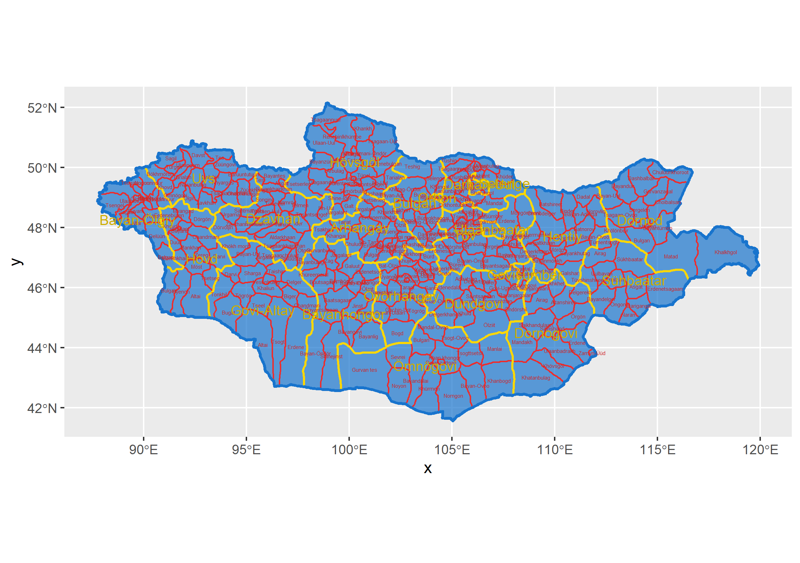

# Final Project - Mongolia

## Political Subdivisions
**to include:**

This map shows all of the administrative subdivisions in Mongolia. The first level are the aimags, or provinces, of which there are 21 (not including the Capital region of Mongolia). On this map, the provinces are shown in yellow. The second level of administrative subdivision is the sum, or district, level. Mongolia has 331 districts. These are shown in red. Mongolia is divided into districts that attempt to be approximately equal in geographic size and population, however you can tell that the outer districts are less populated since they are larger, and the inner districts are more populated because they are physically smaller. When looking at the pysical geography of Mongolia, this makes sense, because the country's harsher environments are near the border.
In my work, I focused on two areas of Mongolia. Their relation to the rest of the country is shown here:

Khovsgol is a region in the North of Mongolia. 

For more information, see [Project 1](https://caroline-mccain.github.io/workshop/Project1).

## Population
**to include:**
1. map of distributions
2. overall model
3. adm 2 maps of diff

For more information, see [Project 1](https://caroline-mccain.github.io/workshop/Project1) and [Project 2](https://caroline-mccain.github.io/workshop/Project2).

## Human Settlements, Roadways, and Health Care Facilities
**to include**
1. density plots
2. urban areas
3. map with roads
4. 3d plots
For more information, see [Project 3](https://caroline-mccain.github.io/workshop/Project3) and
[Project 4](https://caroline-mccain.github.io/workshop/Project4).
