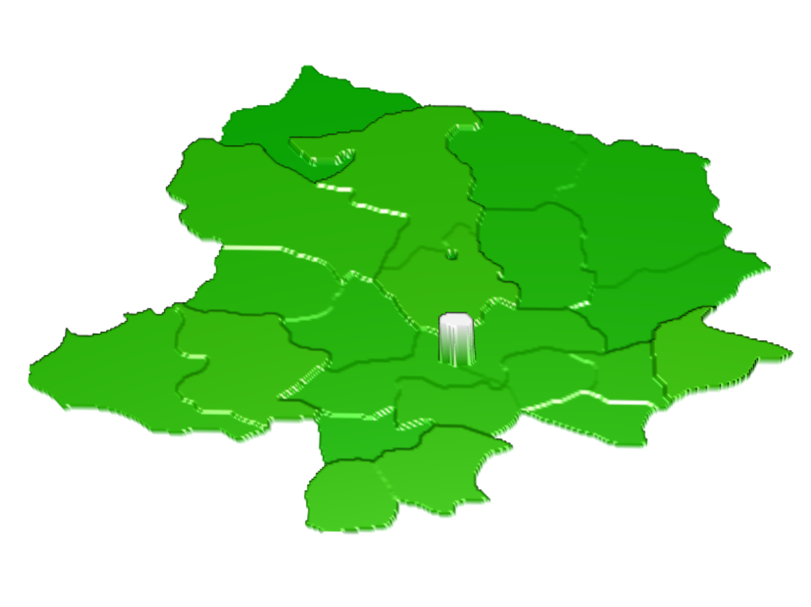
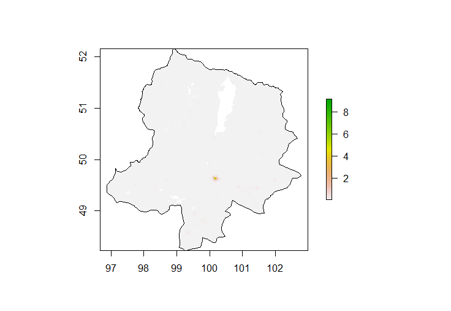

# Final Project - Mongolia

## Political Subdivisions

This map shows all of the administrative subdivisions in Mongolia. The first level are the aimags, or provinces, of which there are 21 (not including the Capital region of Mongolia). On this map, the provinces are shown in yellow. The second level of administrative subdivision is the sum, or district, level. Mongolia has 331 districts. These are shown in red. Mongolia is divided into districts that attempt to be approximately equal in geographic size and population, however you can tell that the outer districts are less populated since they are larger, and the inner districts are more populated because they are physically smaller. When looking at the pysical geography of Mongolia, this makes sense, because the country's harsher environments are near the border.
In my work, I focused on two areas of Mongolia. Their position in relation to the rest of the country is shown here:

Khovsgol is a province in the northwest of Mongolia. It is subdivided into 23 sums.

Darhan-Uul is a province in the north of Mongolia. It is subdivided into four sums.

**For more information, see [Project 1](https://caroline-mccain.github.io/workshop/Project1).**

## Population

This first map shows the population of Mongolia across the entire country, illustrating that it is quite sparsely populated except for a few cities. Mongolia's total population is 3,186,026 people, but the capital city Ulaanbatar alone has a population of 1,584,000. This sets up a pattern of dense urban areas and sparse rural areas. The rural areas dominate the country physically.
The rest of my population inquiries focused on Khovsgol, which has a population of 132,146. Most of that population is concentrated in the city of Moron, which has a population of 39,404.

When using all of the available topographic, slope, water, and land cover data to estimate a model of the population, it is not very accurate. The r^2 value is approximately .22.

This inaccuracy is likely due to the variety of terrain in the region and the nomadic and semi-nomadic lifestyles of the Mongolian people.

The above map shows that the errors in the population model are primarily underpredictions in the city of Moron. This problem is clearly shown by a 3D plot of Khovsgol.

Because a next level of administrative subdivision was not available for Mongolia, the City of Moron cannot be further investigated to determine a more specific reason for this discrepancy.

Consequently, the best judgement is that these errors are due to problems with the gridcelled approach when looking at urban buidlings. The low population density in outlying areas makes it easier to make spatially accurate predictions. In the city, however, it is a small population with a high population density. Nevertheless, the majority of the population of Khovsgol is quite rural, as shown by the plot below.

This pattern of having an aimag capital that is densely populated and a sparsely populated surrounding area is repeated throughout Mongolia, which leads to challenges with development.

**For more information, see [Project 1](https://caroline-mccain.github.io/workshop/Project1) and [Project 2](https://caroline-mccain.github.io/workshop/Project2).**

## Human Settlements, Roadways, and Health Care Facilities
For this part of the project, I switched to focusing on the Darhan-Uul aimag. I joined the Darhan-Uul aimag with the sums of Khushaat and Saykhan. This is a geographically small region that has a few urbanized areas. Darkhan-Uul has a population of 101,879. Khushaat has a population of 1,585 and Saykhan has a population of 8,285.

The above map shows the urban areas, their relative populations and densities. The map below shows where roads and healthcare facilities are located within the region. The darkest purple road that is the largest main road in the region, classified as a trunk road. The smaller, lighter purple roads are classified as roads, tracks, secondary roads, tertiary roads, and service roads. Hospital facilities are shown as blue dots, and dentists are orange.

This map makes it seem that the less urbanized areas are drastically underserved. The roads do not appear to reach throughout the region to provide connections, and the healthcare facilities are only located within urban areas. 

**For more information, see [Project 3](https://caroline-mccain.github.io/workshop/Project3) and
[Project 4](https://caroline-mccain.github.io/workshop/Project4).**

## Final Thoughts
