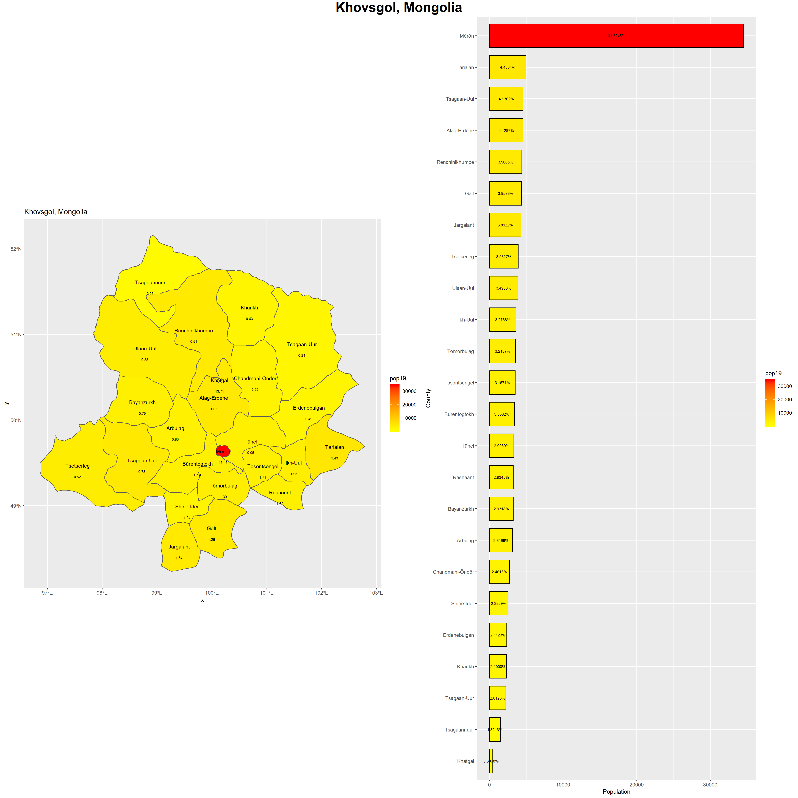

# Project 1: Administrative Units, Population, and Description - Mongolia

## Part 1: Administrative Subdivisions
The purpose of this part was to create a map with the administrative subdivisions of our selected Lower Middle Income Country. In Mongolia, the first level of subdivision is the province, and on my map they are labeled in yellow. The lower level is the district level, and these are represented in red. If you look closely, you'll see that the districts are more compact in the center of the country, and they get larger closer to Mongolia's borders. This is likely due to the fact that in those border regions the population is more sparse. If you look at Mongolia's physical geography, the terrain in these areas is less suitable for settlement since it's a desert.
My biggest difficultly with this step of the project was ordering the layers correctly to have colors appear. Since in the next step I would have to subdivide the country and focus on one region, Khovsgol (Hövsgöl), I included a map of the districts of this province.

## Part 2: Populations
In this part of the project, we added a population layer from a raster to our previously created maps. Since Mongolia is so geographically large, I took a subset of the country, Khovsgol, to use throughout the project. The first two plots are just the population added to the international border. The next two are different heat maps of Khovsgol. The first is just the population, and the second is the log of the population. All of these maps indicate that outside of cities, Mongolia has incredibly low population density. This is due to a relatively small population spread over a massive land area. The small population is likely due to the harsh terrain and the difficulties of the nomadic lifestyle.
The biggest challenge I ran into had to do with saving things and reloading them versus inadvertantly re-running things. I also had my computer in a power saving mode that overrode attempts at parallel processing, which I did not realize at first. But, once I realized this and how to save data frames to reload instead of recalculate things went faster.

## Part 3: Geometric Bar Plot
The final step of the project involved matching the heat map of the region with a bar graph of the populations. Population density for each district was also calculated and added on to the map. The bar graph shows the stark differences in population between the city, Moron, and the rest of Khovsgol. The population density values listed on the map also reflect the difference. Most of the districts have a population density around 1.5 people/km^2, whereas Moron's is almost 155 people/km^2. For reference, Virginia's population density is 202.6 people/mi^2 (converted: 78.2 people/km^2).
The biggest challenge with this part of the project was typing things correctly and making sure I had the variables named correctly to display everything.

