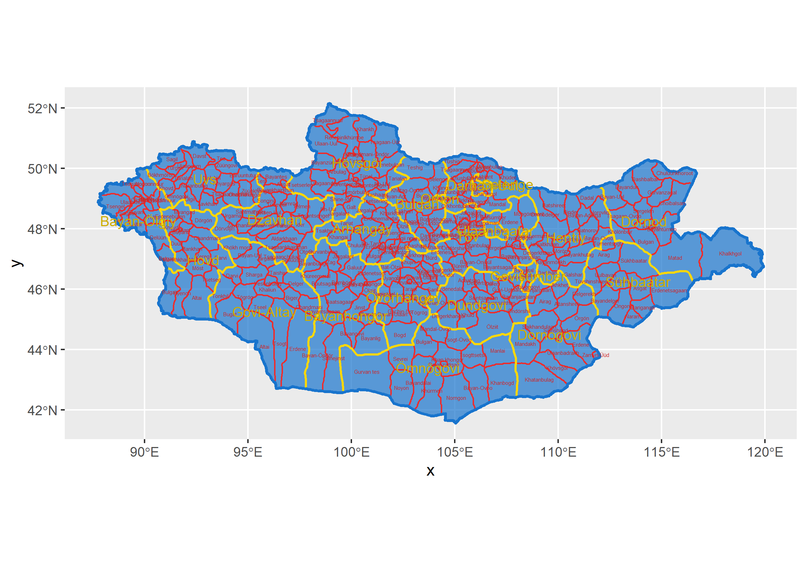
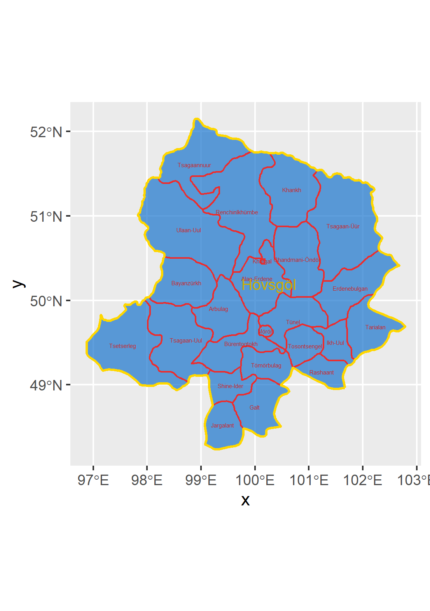
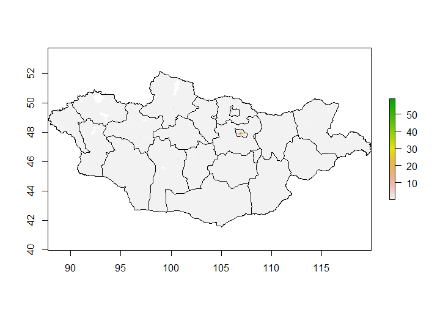
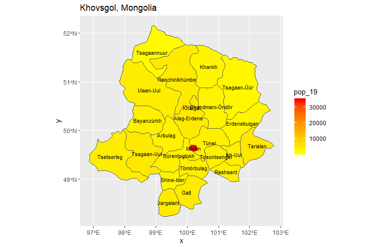
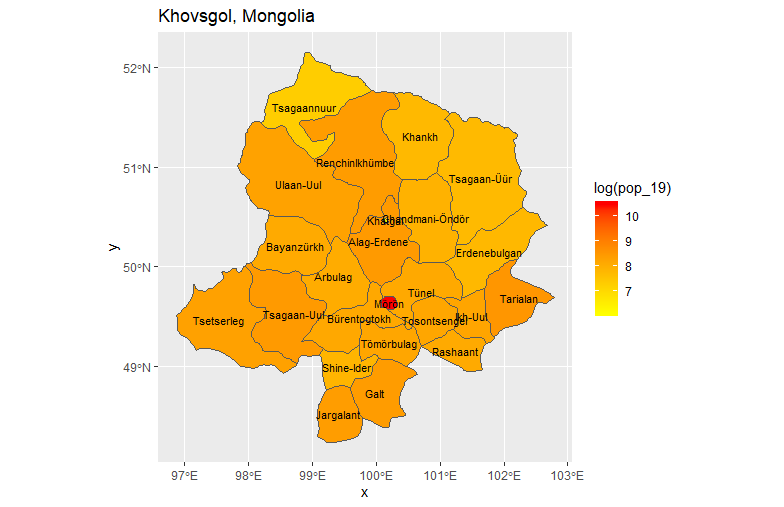
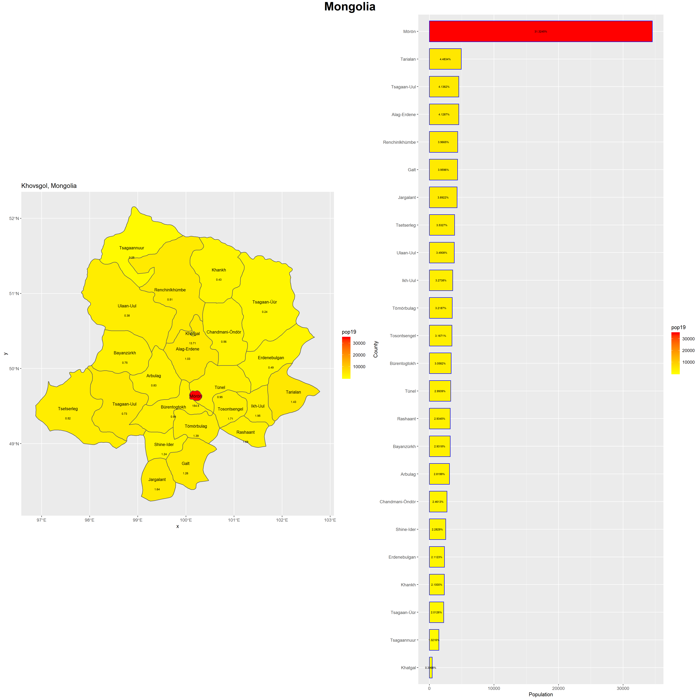

# Project 1: Mongolia

## Part 1: Adminstrative Subdivisions
The purpose of this part was to create a map with the adminstrative subdivisions of our selected Lower Middle Income Country. In Mongolia, the first level of subdivision is the province, and on my map they are labeled in yellow. The lower level is the district level, and these are represented in red. My biggest difficultly with this step of the project was ordering the layers correctly to have colors appear. Since in the next step I would have to subdivide the country and focus on one region, Khovsgol, I included a map of the districts of this province.

## Part 2: Populations
In this part of the project, we added a population layer from a raster to our previously created maps. Since Mongolia is so geographically large, I took a subset of the country, Khovsgol, to use throughout the project. The first two plots are just the population added to the international border. The next two are different heat maps of Khovsgol. The first is just the population, and the second is the log of the population. The biggest challenge I ran into had to do with saving things and reloading them versus inadvertantly re-running things. I also had my computer in a power saving mode that overrode attempts at parallel processing, which I did not realize at first. But, once I realized this and how to save data frames to reload instead of recalculate things went faster. 

## Part 3: Geometric Bar Plot

