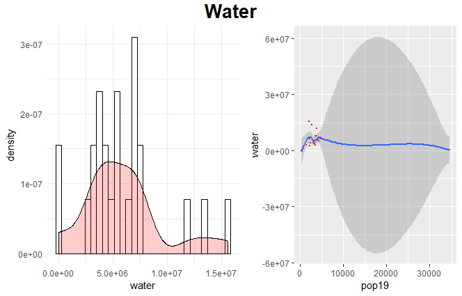
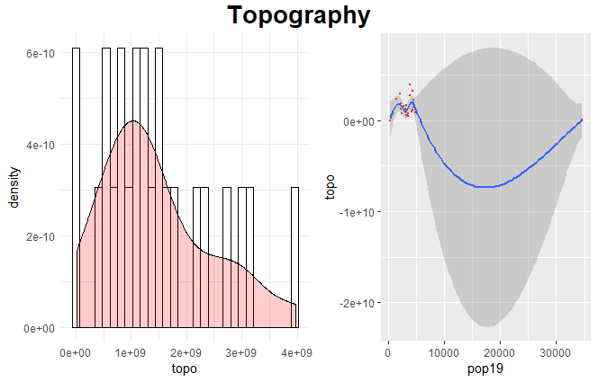
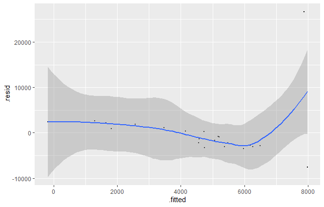

# Project 2: Investigating Land Use and Land Cover - Mongolia

## Part 1: Histograms with Density Plots and Linear Models
This part of the project involved taking land use and land cover variables and using them to make predictions of population values.
### Water
I first made a model of just water source variables to predict the population of Khovsgol. I chose to start with just water because of Mongolia's history of having a nomadic population, and water sources would be one factor driving movement. Additionally, most major cities were developed along waterways. However, using just the one variable was not very accurate. This inaccuracy is highlighted in the distorted shape of the linear model. Additionally,

### Topo
I then decided that in order to make a more accurate prediction while still exploring variables, I looked at topography. Again, topography would have played an important role in the history of Mongolia. Again, just using the one does not yield very accurate results. However, the linear model that combines water values and topography values is much more accurate than either of the single variables alone.

### Slope
The final variable I explored individually was slope, for the same reasons mentioned above. Again, it did not prove to be reliable on its own. But, when combining slope data with topography and water data, the linear model is much more accurate.
### All
The following are the results for combining all land use and land cover variables. 
