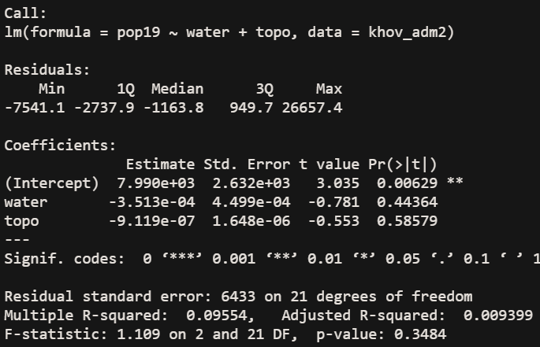
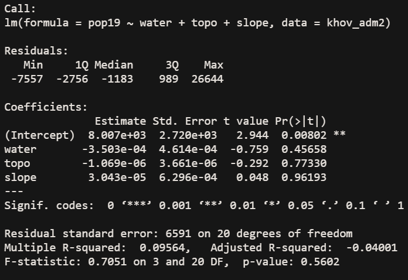

# Project 2: Investigating Land Use and Land Cover - Mongolia

## Part 1: Histograms with Density Plots and Linear Models
This part of the project involved taking land use and land cover variables and using them to make predictions of population values. First, for reference, these are histograms of the population and density of Khovsgol.

This shows that the majority of ADM subdivisions within Khovsgol have a population below 10,000, and only one ADM subdivision is over that, with a population of > 30,000.

This plot maps the population with the corresponding population density values, which are very low.

This plot shows the logarithm of the population, which shows a more even distribution of the population through Khovsgol.

This plot shows the population density with the logarithm of the population.
### Water
I first made a model of just water source variables to predict the population of Khovsgol. I chose to start with just water because of Mongolia's history of having a nomadic population, and water sources would be one factor driving movement. Additionally, most major cities were developed along waterways. However, using just the one variable was not very accurate. This inaccuracy is highlighted in the distorted shape of the linear model.

### Topo
I then decided that in order to make a more accurate prediction while still exploring variables, I looked at topography. Again, topography would have played an important role in the history of Mongolia. Again, just using the one does not yield very accurate results. However, the linear model that combines water values and topography values is much more accurate than either of the single variables alone. Still, just using two variables yields a very low r^2 value of .094.

### Slope
The final variable I explored individually was slope, for the same reasons mentioned above. Again, it did not prove to be reliable on its own. But, when combining slope data with topography and water data, the linear model is much more accurate.

### All
The following are the results for combining all land use and land cover variables.

Again, the r^2 value is quite low, at .095. The correlation shown in the linear model is much improved when all of the variables are used. A low correlation would be expected, given the nature of Mongolia. The total population of Khovsgol is 132,146 as of 2017. This leads to a population density of 1.36 people/km^2 throughout the province. However, the capital city, Moron, has a population of 39,404 which is about 30% of the population of the province. As I noted last time, the population density grows about tenfold when you're considering just that city. However, even with these considerations in mind, the r^2 value is quite low. The great variety in terrain, the presence of nomadic populations, and the large Lake Khovsgol could all contribute to the inaccuracy of this model. I think the biggest cause is nomadic people, due to the fact that yurts probably don't show up when looking at built land satellite data and that they would not contribute much in terms of night time light values.

## Part 2: Modeling and Predicting Spatial Values
In this part of the project, the dependent variable is the actual population. This value is being predicted by the geospatial covariates discussed and explored in the first part of the project.
