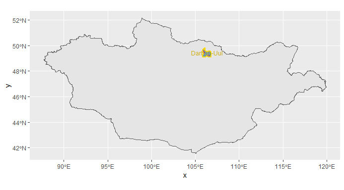
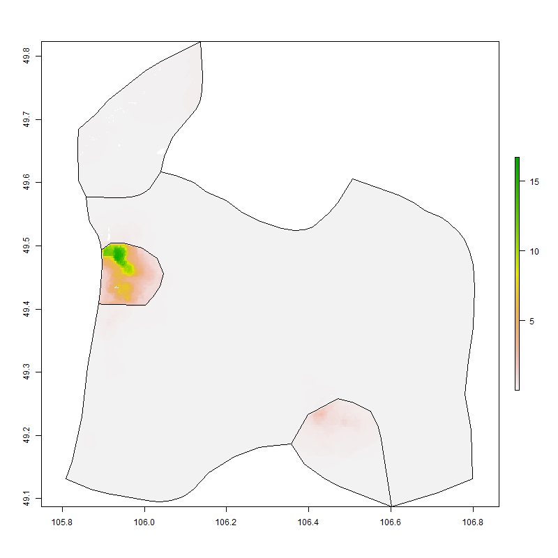
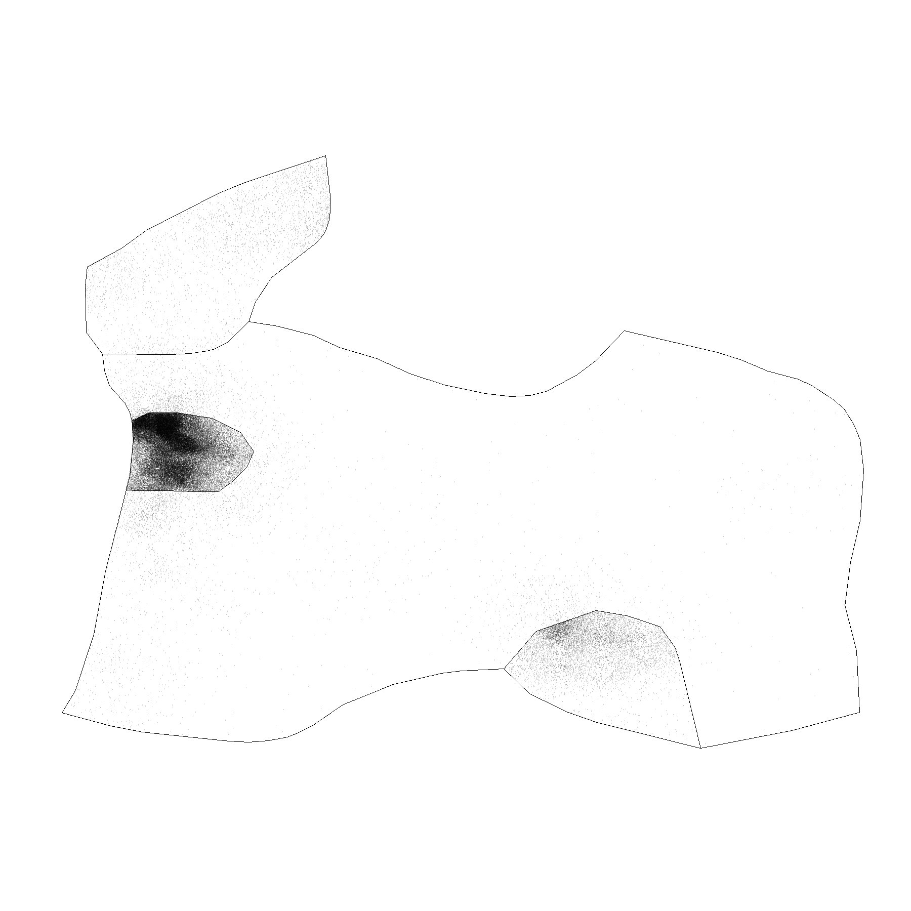
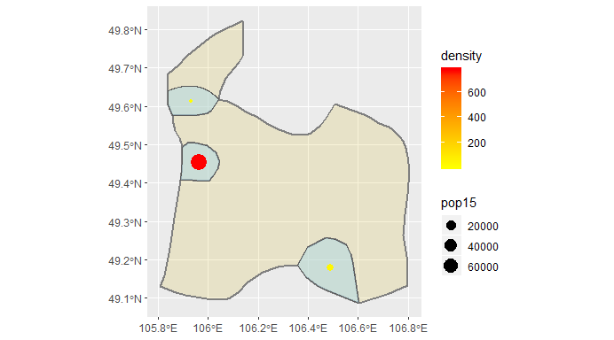
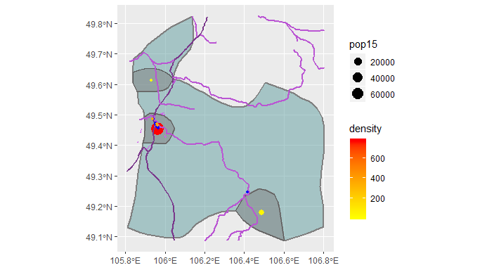
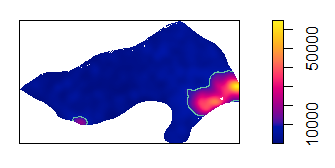
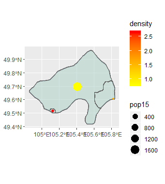
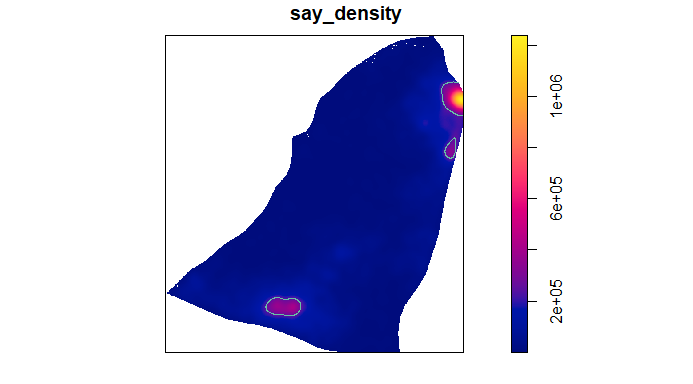
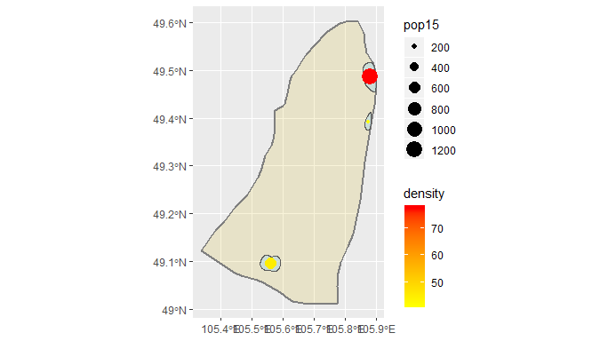
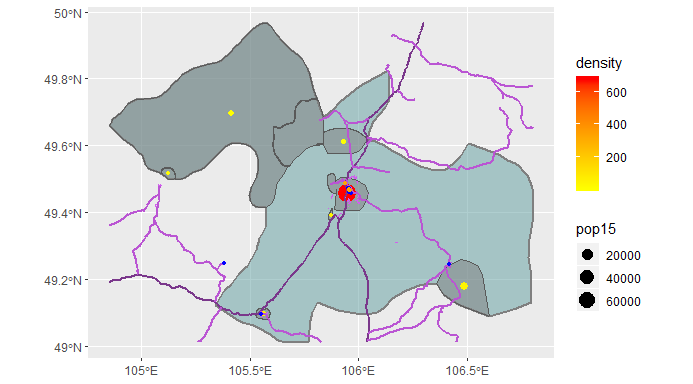

# Project 3: Accessibility to Health Care through Transportation Facilities

## Part 1: De Facto Description of Human Settlements and Urban Areas
For this project, I switched to a new region of Mongolia. I am now examining the Darkhan-Uul Province of Mongolia, which is at the ADM 1 level.

It is composed of four sub-districts, and has a population of 101,879 for an overall population density of 31 people/km^2.

This plot shows where the population is per grid cell according to World Pop.

This represents an estimate as to where every individual is located.

This image shows the polygons of urban areas based on population.

This overlays the distinct inside and outside polygons over the density prediction image.

This image shows the 3 urban areas in Darkhan-Uul. The most populated area has the densest population, and is the city of Darkhan, which is the capital of the Province. In the bottom right, you can see the urbanized area of Sharyngol. The urbanized area above Darkhan is likely a suburb of some kind.

## Part 2: Adding Transportation Facilities and Access to Healthcare

Access to healthcare depends on access to roads. In the above plot, main roads are shown in the darkest purple. The other roads are categorized as 'road,' 'secondary,' and 'tertiary.' These are clearly able to connect the urbanized areas, but they don't seem to connect rural areas to urban areas particularly well. Adding in additional road types does seem to minimally improve connectivity to rural areas, but this clutters the map so they have been omitted.
In terms of healthcare, hospitals are shown in blue, dentists in orange, and pharmacies in green. Again, these are clustered in urban areas and near where roads intersect.
As somebody who comes from a rural area and regularly drives 45 minutes or more for doctors' appointments, I would not call this fully accessible healthcare, especially because even within urbanized areas options are limited. The data I accessed from HDX indicates that there is only one pharmacy in the province. However, given the population distribution of Mongolia it does not seem like there can be a whole lot that can be done in terms of building more accessible facilities. I think more appropriate change would come from increasing telehealth and other remote provider options.

In an attempt to expand my examination of the region, I explored two neighboring ADM 2 subdivisions, Khushaat and Saykhan. Khushaat is part of the Selenge Province of Mongolia and has a population around 1,800. Saykhan is another subdivision of the Selenge province witha population of 8,285. These two provinces border Darkhan City, which is why I thought they would be interesting to examine. Darkhan-Uul was carved out of the Selenge province, but it would have been too unwieldy to explore both whole ADM 1 levels.

The following plots are from generating the urban areas model of Khushaat.

I attempted to filter out the larger region based on population density, but for some reason that eliminated the other urban areas as well. I ran into problems with not having inside polygons, so I think something went wrong there.

The following plots are from generating the urban areas model of Saykhan.

This center points plot turned out well, I think because it had multiple clearly defined points and it could merge the polygons into one easily. Saykhan clearly has the three urban areas. These de facto areas correspond with truly urbanized areas in the context of Mongolia.

To compare access over this larger region, I plotted the roads and healthcare facilities in the same way.

Something clearly did not transfer into the Khushaat region, but the Saykhan region merged nicely. This again shows that the roads are able to connect urbanized areas and healthcare facilities are really only found in urbanized areas. While it is difficult to justify increasing the numbers of facilities based on the population numbers of Mongolia, I think that work can be done to improve the accessibility of healthcare through telehealth and other provider options which these maps won't reflect.
I'm not sure why the Khushaat region isn't showing the data in this unioned model, but I think it may have something to do with the fact that I was trying to merge three areas of different administrative levels. Additionally, the densities generated and used for the urban areas polygons all differ by an order of magnitude, showing how unequally Mongolia's population is distributed.

## Conclusions
The population distribution of Mongolia was the most challenging part of this project. It was difficult to find a region that had an appropriate population over an appropriately sized geographic area. This challenging population distribution has led me to the conclusion that not much can be done in terms of improving access to physical buildings. Instead, I think that work needs to be done to improve options. Darkhan-Uul had 0 clinics. I think that creating more informal healthcare options along with increasing availability of telehealth would improve overall access to healthcare. Another idea I have seen to be successful at home is special events where specialists come in to spend the day doing charity vision tests, blood pressure tests, and cholesterol screenings among other diagnostic tools. Organizing events where doctors traveled from the more urbanized areas out to more rural ones every so often could also help with healthcare access. 
