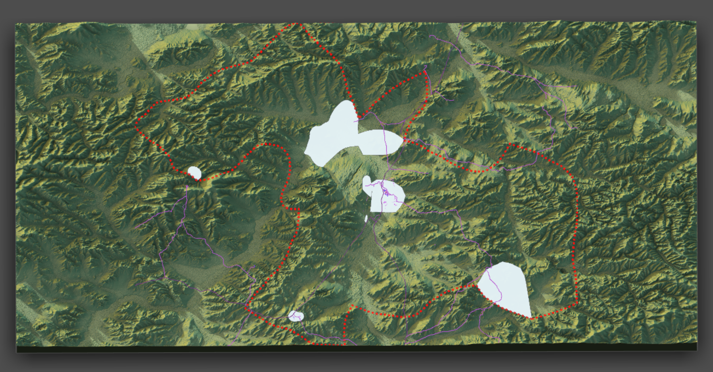
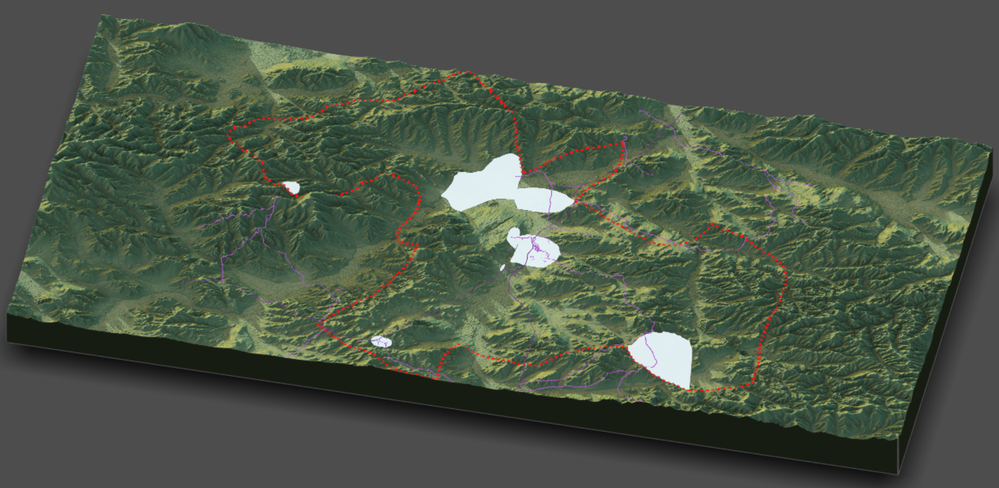

# Project 4: Rendering Topography

Topography has heavily impacted development, as I had anticipated with Mongolia. Looking at topographic maps makes it much clearer as to why the populations are distributed the way that they are. Urban areas are concentrated in flatlands, and the more mountainous areas are not populated. While something is still going wrong with the crop of the roads, it is again clear that the mountainous terrain influences their paths. Seeing the topography has helped to confirm and further explain the conclusions I came to last time. 
